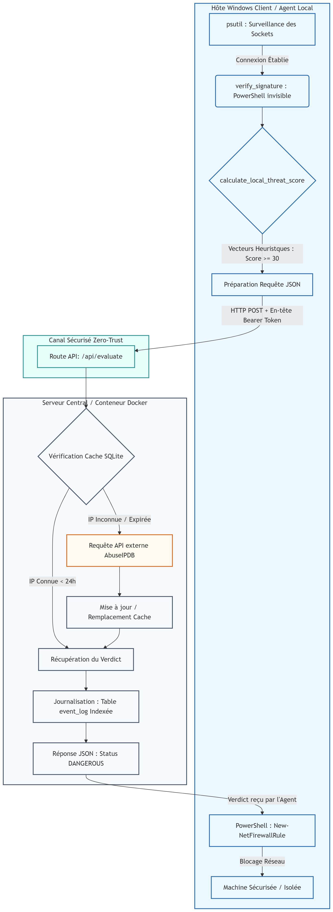

# 🛡️ HEMIPSystem (Hybrid Endpoint Monitoring & Intrusion Prevention System)

An enterprise-ready, high-performance hybrid Host-based Intrusion Detection and Prevention System (HIDS/IPS). HEMIPSystem embraces DevSecOps principles by separating the resource-heavy threat intelligence core (fully containerized via Docker) from the low-overhead endpoint monitoring agent (Native Windows executable environment).

The platform features an optimized **Edge-AI Heuristic Engine** running locally on endpoints for lightning-fast zero-day pre-filtering, paired with a central microservices backend providing persistent cross-reboot digital signature caching, time-indexed SQL logging, and real-time security observability.



---

## ✨ System Features & Performance Engineering

* **Containerized Asymmetric Backend:** Built on an asynchronous Python/Flask microcontainer engine deployed using **Docker** and **Docker Compose**, providing instant, OS-agnostic provisioning.
* **Edge-AI Heuristic Scoring:** The client probe evaluates real-time multi-vector risks locally (e.g., untrusted user storage paths, unstandardized outbound ports, missing digital signatures, and Living-off-the-Land identity impersonation vectors).
* **Zero-Trust Token Authentication:** Telemetry communication pipelines are strictly hardened via asymmetric `Bearer Token` authentication headers (`AGENT_SECRET_KEY`) to eliminate rogue data injection or telemetry log spoofing.
* **Stateful Signature Caching:** Drastically reduces high-overhead Windows subshell (PowerShell Authenticode) calls by saving validated binary cryptographic footprints to an on-disk serialized registry (`signature_cache.json`) that survives host machine reboots.
* **Optimized Database Indexing:** Incorporates a structural database index over the logging timestamp layers. Graph aggregation workflows compute metrics continuously at $O(1)$ scaling speeds rather than reading the database linearly ($O(n)$) as history grows.
* **Active IPS (Intrusion Prevention):** Interfaces natively with the host network stack and invokes dynamic PowerShell automation chains to configure real-time **Windows Defender Firewall Outbound Blocking Rules** when critical risk thresholds are crossed.
* **Observability Dashboard:** Offers a sleek, real-time streaming web UI driven by `Chart.js` tracking Safe vs. Dangerous connection vectors across the network infrastructure alongside a live security audit log.

---

## 🏗️ Architectural Topology

1. **The Server Core (Backend / Dockerized):**
   * Processes incoming validated payloads and handles global intelligence routing.
   * Isolates the relational database (`threat_cache.db`) within a mounted persistent data volume.
   * Proxies downstream external queries to global Threat Intelligence Providers (AbuseIPDB V2 REST API), applying aggressive 24-hour time-caching to preserve strict API rate limits.

2. **The Endpoint Probe (Windows Native Agent):**
   * Operates silently with elevated administrative rights, mapping active network socket bindings using `psutil`.
   * Spawns isolated background subshells utilizing hidden creation flags (`0x08000000`) to query binary cryptographic status flags without disrupting the user workspace.
   * Triggers immediate native remediation workflows and alert mechanisms.

---

## 🚀 Deployment & Installation Blueprint

### Part 1: Central Server Deployment (DevOps Infrastructure)

**Prerequisites:** Docker and Docker Compose configured on the management server (Linux/Ubuntu recommended, but Windows/macOS environments are fully supported).

1. Navigate to your central server configuration directory:
   ```bash
   cd server/
   ```

2. Provision your environment configuration. Generate a strong, unguessable cryptographic token string (e.g., via `python -c "import secrets; print(secrets.token_hex(32))"`) and create a `.env` file:
   ```env
   ABUSEIPDB_API_KEY=your_private_abuseipdb_api_key_here
   THREAT_THRESHOLD=20
   CACHE_EXPIRY_DAYS=1
   AGENT_SECRET_KEY=your_securely_generated_token_string
   ```

3. Spin up the containerized microservices infrastructure:
   ```bash
   docker-compose up --build -d
   ```

4. Verify service health by opening your web browser and navigating to the live dashboard at: `http://localhost:5000`

---

### Part 2: Endpoint Node Installation (Native Windows)

**Prerequisites:** Windows 10/11 workstation, a clean Python 3.10+ installation, and elevated **Administrator Privileges** (mandatory for embedding firewall hooks).

1. Enter the agent module workspace and download the required lightweight tracking dependencies:
   ```bash
   cd agent/
   pip install psutil requests python-dotenv plyer
   ```

2. Establish your local parameter variables inside `agent/.env`. The secret authentication key **must perfectly match** the one provisioned on the server:
   ```env
   SERVER_API_URL=http://<YOUR_SERVER_IP>:5000/api/evaluate
   AGENT_SECRET_KEY=your_securely_generated_token_string
   ```
   *(Replace `<YOUR_SERVER_IP>` with the actual IP address of your Docker host machine if it is deployed on a separate network node).*

3. Launch the background monitoring probe using an elevated Administrative console (Run as Administrator):
   ```bash
   python agent.py
   ```

---

## 💻 Operational Runbook & Usage

1. **Continuous Auditing:** Once initialized, the agent loops continuously over active sockets. If an unsigned binary binds outwards to an external address, its local heuristic signature is calculated.
2. **Telemetry Uplink:** Suspicious indicator contexts bypass local limitations and escalate to the Docker cluster over the chiffré Bearer Auth link. The backend registers the event and streams immediate updates to the web graph.
3. **Active Remediation:** When a `DANGEROUS` status confirms or local thresholds break critical boundaries, a desktop notification triggers. Confirming the prompt runs an immediate background block instruction:
   ```powershell
   New-NetFirewallRule -DisplayName "EDR_IPS_BLOCK_IP" -Direction Outbound -Action Block -RemoteAddress X.X.X.X
   ```
   This instantly severes the outbound connection to the untrusted infrastructure.

---

## ⚠️ Defensive Notice & Disclaimer

This platform is developed strictly for educational purposes, pedagogical security research, and corporate systems auditing. Automatically injecting runtime modification rules into host operating system firewalls introduces operational networking risks. Always ensure infrastructure targets are properly vetted before scaling deployment models. The software developers assume zero liability for operational network disruptions or downtime.
